_Instrucciones : https://experiencia21.tec.mx/courses/482333/assignments/15445488_

# Proyecto Final - Lenguajes de Programación

## Installation and execution

### Installation

You will need to install python>=3.8 and conda to run this project.

Then create a conda env

```bash
conda create -n <env_name> python=3.8
```

Activate the conda env

```bash
    conda activate <env_name>
```

Then install the dependencies by running:

```bash
pip install -r requirements.txt
```

Then, you can install the dependencies by running:

```bash
pip install -r requirements.txt
```

### Execution

To run the project, you can run the following command:

In interactive mode

```bash
python main.py -m i
```

In file mode (this will parse the file and print the results)

```bash
python main.py -m f -f <file_path>
```

### Testing

To run the tests, you can run the following command:

```bash
python testing.py
```

This will run the tests and print the results as well as create the corresponding trees for each line of the test.

## Rules of the grammar

```
Rule 0     S' -> statements
Rule 1     statements -> statement
Rule 2     statement -> assignment
Rule 3     statement -> index
Rule 4     statement -> conditional
Rule 5     statement -> expression
Rule 6     conditional -> IF LPAREN comparison RPAREN OPEN_CURLY statements CLOSE_CURLY
Rule 7     conditional -> IF LPAREN comparison RPAREN OPEN_CURLY statements CLOSE_CURLY ELSE OPEN_CURLY statements CLOSE_CURLY
Rule 8     assignment -> VARIABLE LBRACK expression RBRACK EQUAL expression
Rule 9     assignment -> VARIABLE EQUAL expression
Rule 10    assignment -> VARIABLE EQUAL flow
Rule 11    comparison -> expression GREATER expression
Rule 12    comparison -> expression LESS expression
Rule 13    comparison -> expression GREATER_EQUAL expression
Rule 14    comparison -> expression LESS_EQUAL expression
Rule 15    comparison -> expression EQUAL_EQUAL expression
Rule 16    comparison -> expression NOT_EQUAL expression
Rule 17    flow -> VARIABLE CONNECT flow_functions
Rule 18    flow_functions -> flow_function_call CONNECT flow_functions
Rule 19    flow_functions -> flow_function_call
Rule 20    flow_function_call -> VARIABLE LPAREN params RPAREN
Rule 21    expression -> expression PLUS term
Rule 22    expression -> expression MINUS term
Rule 23    expression -> term
Rule 24    expression -> string
Rule 25    string -> STRING
Rule 26    expression -> NONE
Rule 27    term -> exponent
Rule 28    term -> term TIMES exponent
Rule 29    term -> term DIV exponent
Rule 30    exponent -> factor
Rule 31    exponent -> factor EXP factor
Rule 32    factor -> NUMBER
Rule 33    factor -> VARIABLE
Rule 34    factor -> LPAREN expression RPAREN
Rule 35    factor -> list
Rule 36    factor -> list_empty
Rule 37    list_empty -> LBRACK RBRACK
Rule 38    list -> LBRACK list_elements RBRACK
Rule 39    list_elements -> list_elements COMMA expression
Rule 40    list_elements -> expression
Rule 41    index -> VARIABLE LBRACK expression RBRACK
Rule 42    factor -> function_call
Rule 43    function_call -> VARIABLE LPAREN RPAREN
Rule 44    function_call -> VARIABLE LPAREN params RPAREN
Rule 45    params -> params COMMA expression
Rule 46    params -> expression
```

## Description of functionalities

### Arithmetic Operators

The language supports the following arithmetic operators: +, -, \*, /, ^
The precedence of this is achived by simple arithmetic rules, where the exponentiation has the highest precedence, followed by multiplication and division, and finally addition and subtraction. This is achieved by the following rules:

```
Rule 21 expression -> expression PLUS term
Rule 22 expression -> expression MINUS term
Rule 28 term -> term TIMES exponent
Rule 29 term -> term DIV exponent
Rule 31 exponent -> factor EXP factor
```

#### Examples with corresponding trees

5+5

6+5
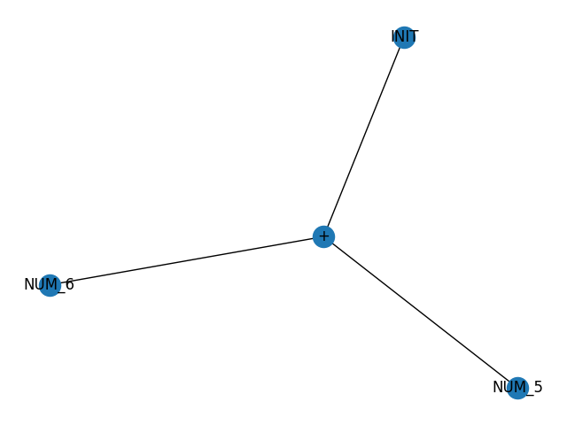
a-b
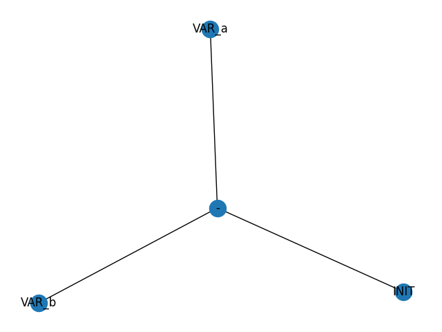
1/1+1*5^2


### Assignment

Assignment is done by using the equal sign. The language supports it by the following rules:

```
Rule 8 assignment -> VARIABLE LBRACK expression RBRACK EQUAL expression
Rule 9 assignment -> VARIABLE EQUAL expression
Rule 10 assignment -> VARIABLE EQUAL flow
```

#### Examples with corresponding trees

a=6
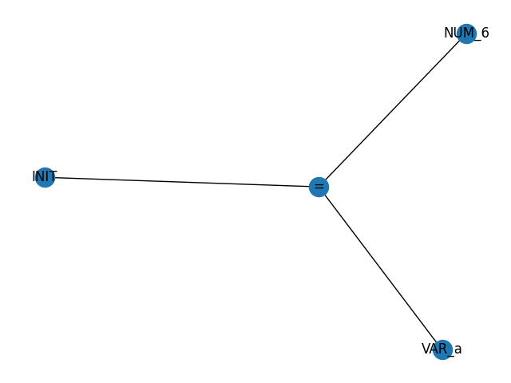
b=a+2


### Conditional (if-else)

#### Examples with corresponding trees

if(1==1){a=1}
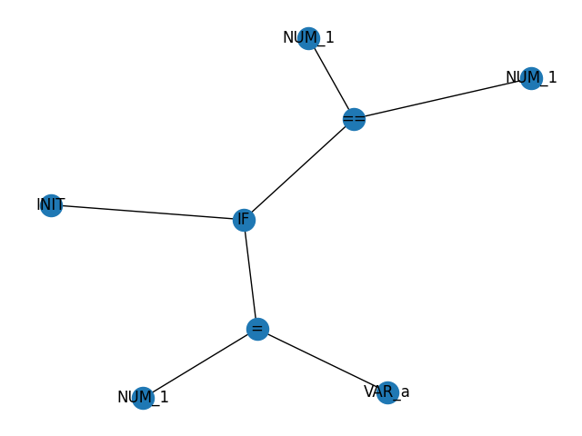
if(a>2){a=1}else{a=2}
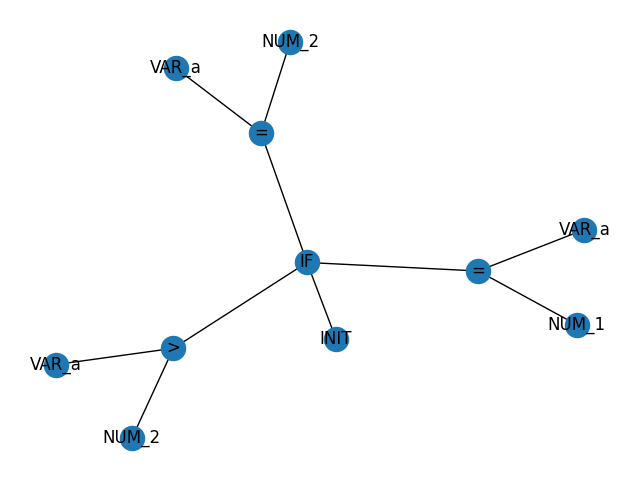
if(1==1){if(a==2){8}}else{5}
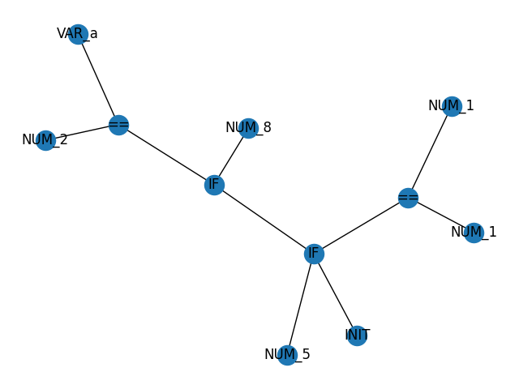

### Functions

Functions are defined by using the following rules:

```
Rule 42 factor -> function_call
Rule 43 function_call -> VARIABLE LPAREN RPAREN
Rule 44 function_call -> VARIABLE LPAREN params RPAREN
Rule 45 params -> params COMMA expression
```

They are able to be called with or without parameters.

#### Examples with corresponding trees

myPrint("Hello World")
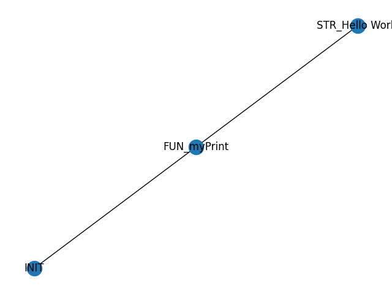
do_nothing()
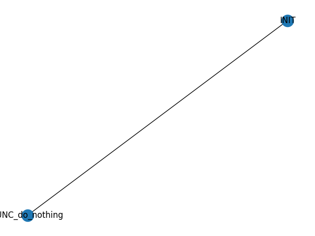
sumAB(3,4)
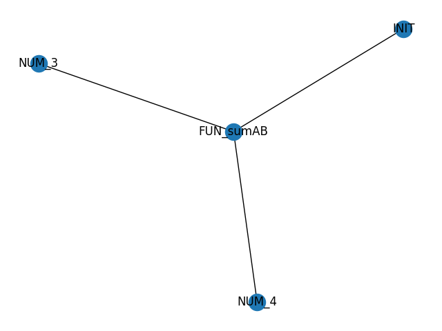
a=gen_vector(10,10)

myPrint(a)

b=load("images/test.jpeg")
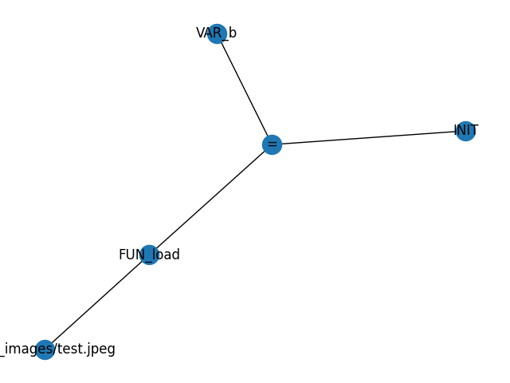

### Lists

Lists are defined following the next language rules:

```
Rule 37    list_empty -> LBRACK RBRACK
Rule 38    list -> LBRACK list_elements RBRACK
Rule 39    list_elements -> list_elements COMMA expression
Rule 40    list_elements -> expression
```

#### Examples with corresponding trees

a=[1,2,3,4]
![a=[1,2,3,4]](/trees/testing_cache/test/arrays/arr.txt_0.png)

a[0]
![a=[0]](/trees/testing_cache/test/arrays/arr.txt_1.png)

a[0]=0
![a=[0]](/trees/testing_cache/test/arrays/arr.txt_2.png)

b=[]
![a=[0]](/trees/testing_cache/test/arrays/arr.txt_3.png)
### Flow

This is the brand new feature that we added to the language. This is a way to chain functions together. This is done by the rules defined in the functions section.

#### Examples with corresponding trees

b=a->sumAB(2)->sumAB(4)->sumAB(5)


### None

This means that the variable is able to be assigned to None. This is done by the following rule:

```

Rule 26 expression -> NONE

```

#### Examples with corresponding trees

b=None
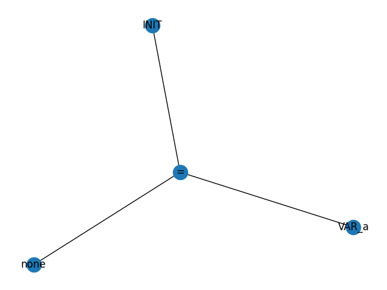
a=1

a=None


### File reading

This is implemented in all the test so there is no need to show it here. We just go line by line and parse the line.

```python
if len(self.command_queue) < 1:
            new_data = input(">")
            self.command_queue.append(new_data)
```

## Videos
